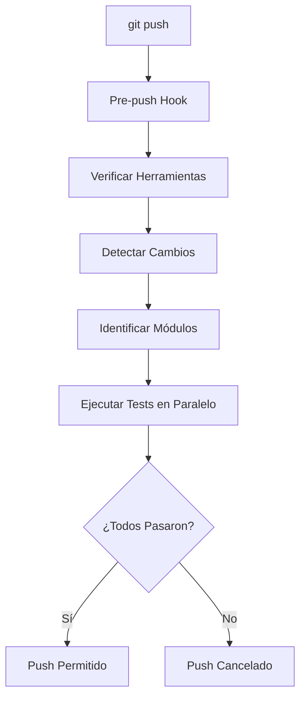

# Git Hooks para Proyecto SaaS Multi-tenant

## 🎯 Objetivo

Este sistema de git hooks automatiza la ejecución de tests, linting y formatting antes de cada push, garantizando la calidad del código en el proyecto multi-tecnología.

## 🚀 Configuración Rápida

```bash
# Configuración inicial (solo una vez)
./scripts/setup-hooks.sh

# Instalar herramientas de desarrollo (opcional)
./scripts/install-dev-tools.sh
```

## 📋 Funcionalidades

### ✅ Detección Inteligente de Cambios
- Solo ejecuta tests en módulos que realmente cambiaron
- Analiza archivos modificados desde el último commit
- Optimiza tiempo de ejecución evitando tests innecesarios

### ⚡ Ejecución Paralela
- Tests de diferentes módulos ejecutan en paralelo
- Mejor aprovechamiento de recursos del sistema
- Reducción significativa del tiempo total

### 🔧 Auto-fix Automático
- Aplica formato automáticamente (Go fmt, Prettier, Black)
- Corrige issues de linting cuando es posible
- Commits automáticos de correcciones menores

### 🌐 Soporte Multi-tecnología
- **Go**: `go fmt`, `golangci-lint`, `go test`, `go build`
- **Node.js**: `eslint`, `prettier`, `npm test`, `npm run build`
- **Python**: `black`, `flake8`, `pytest`

### 📚 Instrucciones Automáticas
- Detecta herramientas faltantes
- Proporciona comandos exactos de instalación
- Diferencia entre herramientas obligatorias y opcionales

## 🏗️ Arquitectura

### Estructura de Archivos

```
saas/
├── .git/hooks/pre-push              # Hook instalado automáticamente
├── scripts/
│   ├── hooks/pre-push               # Hook fuente
│   ├── setup-hooks.sh               # Script de configuración
│   └── install-dev-tools.sh         # Instalador de herramientas
└── documentation/GIT_HOOKS.md       # Esta documentación
```

### Flujo de Ejecución



## 🔧 Configuración por Tecnología

### Go (iam, pim)

**Herramientas Requeridas:**
- `go` (obligatorio)
- `golangci-lint` (recomendado)

**Procesos Ejecutados:**
1. `go fmt ./...` - Formato automático
2. `golangci-lint run --fix` - Linting con auto-fix
3. `go build ./...` - Verificación de compilación
4. `go test -v ./...` - Ejecución de tests
5. `go test -cover ./...` - Reporte de cobertura

**Instalación de Herramientas:**
```bash
# Go (macOS)
brew install go

# Go (Linux)
wget -O go.tar.gz https://golang.org/dl/go1.21.0.linux-amd64.tar.gz
sudo tar -C /usr/local -xzf go.tar.gz
echo 'export PATH=$PATH:/usr/local/go/bin' >> ~/.bashrc

# golangci-lint
go install github.com/golangci/golangci-lint/cmd/golangci-lint@latest
```

### Node.js (frontend-activo-crm, backoffice)

**Herramientas Requeridas:**
- `node` (obligatorio)
- `npm` (obligatorio)

**Procesos Ejecutados:**
1. `npm install` - Instalación de dependencias (si es necesario)
2. `npm run lint:fix` - Linting con auto-fix
3. `npm run format` - Formato con Prettier
4. `npm run type-check` - Verificación de tipos TypeScript
5. `npm run build` - Verificación de build
6. `npm run test` - Ejecución de tests

**Scripts Esperados en package.json:**
```json
{
  "scripts": {
    "lint": "eslint .",
    "lint:fix": "eslint . --fix",
    "format": "prettier --write .",
    "type-check": "tsc --noEmit",
    "build": "next build",
    "test": "jest"
  }
}
```

**Instalación de Herramientas:**
```bash
# Node.js (macOS)
brew install node

# Node.js (Linux)
curl -fsSL https://deb.nodesource.com/setup_lts.x | sudo -E bash -
sudo apt-get install -y nodejs
```

### Python (chat)

**Herramientas Requeridas:**
- `python3` (obligatorio)
- `black` (recomendado)
- `flake8` (recomendado)
- `pytest` (recomendado)

**Procesos Ejecutados:**
1. Verificación de `requirements.txt`
2. `black .` - Formato automático
3. `flake8 .` - Linting
4. `pytest` - Ejecución de tests

**Instalación de Herramientas:**
```bash
# Python (macOS)
brew install python

# Python (Linux)
sudo apt-get update
sudo apt-get install -y python3 python3-pip

# Herramientas de linting
pip3 install black flake8 pytest
```

## 🎮 Comandos y Uso

### Comandos Básicos

```bash
# Push normal (ejecuta hooks automáticamente)
git push

# Saltarse hooks temporalmente
git push --no-verify

# Verificar configuración
./scripts/setup-hooks.sh

# Instalar herramientas faltantes
./scripts/install-dev-tools.sh
```

### Ejemplos de Salida

#### ✅ Ejecución Exitosa
```bash
🚀 Ejecutando pre-push hook del proyecto...
⚙️ Verificando herramientas requeridas...
✅ Todas las herramientas requeridas están instaladas
⚙️ Detectando módulos afectados por los cambios...
Archivos modificados:
  iam/src/user/user.go
  iam/test/user_test.go
Módulos a testear: iam
⚙️ Ejecutando tests en paralelo para 1 módulos...
Esperando a que terminen todos los tests...

=== Resultados para iam ===
⚙️ Procesando módulo Go: iam
🔨 Aplicando formato Go...
🔨 Ejecutando linting Go...
⚙️ Verificando compilación...
⚡ Ejecutando tests...
🔍 Verificando cobertura...
✅ Módulo Go iam: PASSED

✅ Todos los tests pasaron exitosamente!

✅ ¡Todos los tests pasaron! Push permitido.
```

#### ❌ Ejecución con Errores
```bash
🚀 Ejecutando pre-push hook del proyecto...
⚙️ Verificando herramientas requeridas...
✅ Todas las herramientas requeridas están instaladas
⚙️ Detectando módulos afectados por los cambios...
Módulos a testear: iam pim
⚙️ Ejecutando tests en paralelo para 2 módulos...

=== Resultados para iam ===
❌ Tests fallaron en iam

=== Resultados para pim ===
✅ Módulo Go pim: PASSED

❌ Tests fallaron en los siguientes módulos: iam

❌ Algunos tests fallaron. Push cancelado.
💡 Tip: Usa 'git push --no-verify' para saltarse este hook si es necesario.
```

## 🔍 Detección de Cambios

### Algoritmo de Detección

1. **Obtener archivos modificados:**
   ```bash
   git diff --name-only HEAD~1..HEAD
   ```

2. **Extraer directorio raíz:**
   ```bash
   echo "iam/src/user.go" | cut -d'/' -f1  # Resultado: iam
   ```

3. **Validar módulos conocidos:**
   - `iam`, `pim` → Go
   - `frontend-activo-crm`, `backoffice` → Node.js
   - `chat` → Python
   - `api-gateway` → Futuro soporte

### Casos Especiales

- **Sin cambios detectados**: Ejecuta tests en todos los módulos
- **Archivos en raíz**: No ejecuta tests específicos
- **Múltiples módulos**: Ejecuta tests en paralelo para todos

## 🚨 Resolución de Problemas

### Error: "Herramienta no encontrada"

```bash
❌ go no está instalado.
Instálalo con: brew install go (macOS) | sudo apt install golang-go (Linux)
```

**Solución:**
1. Ejecutar el comando de instalación proporcionado
2. Reiniciar terminal
3. Volver a intentar el push

### Error: "Tests fallaron"

```bash
❌ Tests fallaron en iam
```

**Solución:**
1. Revisar logs específicos del módulo
2. Corregir tests o código
3. Hacer commit de las correcciones
4. Volver a intentar el push

### Error: "No se encontró script de test"

```bash
⚠️ No se encontró script de test en frontend-activo-crm
⚠️ Agrega un script 'test' en package.json para habilitar testing automático
```

**Solución:**
1. Agregar script de test en `package.json`:
   ```json
   {
     "scripts": {
       "test": "jest"
     }
   }
   ```

### Saltarse Hook Temporalmente

```bash
# Para emergencias o casos especiales
git push --no-verify
```

**⚠️ Usar con precaución**: Solo en casos excepcionales donde se necesite hacer push sin ejecutar tests.

## 🔮 Futuras Mejoras

### Próximas Funcionalidades

1. **Soporte para Kong API Gateway**
   - Tests de configuración
   - Validación de plugins

2. **Integración con CI/CD**
   - Reportes de cobertura
   - Métricas de calidad

3. **Hooks Adicionales**
   - `pre-commit`: Validaciones rápidas
   - `commit-msg`: Formato de mensajes

4. **Configuración Personalizable**
   - Archivo `.githooks.yml`
   - Configuración por módulo

### Optimizaciones Planeadas

- Cache de dependencias Node.js
- Ejecución incremental de tests
- Integración con herramientas de monitoreo
- Reportes de performance

## 📞 Soporte

### Logs y Debugging

Los logs detallados se muestran durante la ejecución. Para debugging adicional:

```bash
# Ejecutar hook manualmente
.git/hooks/pre-push

# Verificar configuración
./scripts/setup-hooks.sh

# Reinstalar hook
rm .git/hooks/pre-push
./scripts/setup-hooks.sh
```

### Contacto

Para problemas o sugerencias relacionadas con los git hooks, contacta al equipo de desarrollo o crea un issue en el repositorio. 