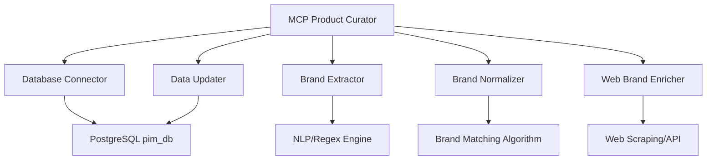

# MCP Product Curator - Diseño y Documentación

## Resumen Ejecutivo

Este documento define el diseño de un MCP (Model Context Protocol) server que se conectará a la base de datos del sistema PIM para curar automáticamente los datos de productos, especialmente enfocado en la corrección y normalización de marcas mal cargadas.

## Problemática Identificada

### Análisis de la Base de Datos Actual

**Tabla `global_products`:**
- **Estructura**: Contiene productos scrapeados de múltiples fuentes
- **Campo `brand`**: VARCHAR(200) que almacena el nombre de la marca
- **Problemas detectados**:
  - Marcas con inconsistencias tipográficas ("Coca-Cola", "CocaCola", "Coca Cola")
  - Productos que incluyen la marca en el nombre ("Samsung Galaxy A54 Samsung")
  - Marcas genéricas o locales ("Almacén Local", "Sin marca")
  - Falta de vinculación con la tabla `brands` normalizada

**Tabla `brands`:**
- **Estructura**: Tabla normalizada con marcas por tenant
- **Campos**: id, tenant_id, name, description, logo_url, website, status
- **Problema**: No está vinculada con `global_products`

## Arquitectura del MCP

### Componentes Principales



### Flujo de Procesamiento

1. **Extracción de productos sin curar**
2. **Análisis de marcas**
3. **Normalización y matching**
4. **Enriquecimiento web**
5. **Actualización de base de datos**

## Especificación Técnica

### 1. MCP Server Structure

```javascript
// mcp-product-curator/
├── src/
│   ├── index.js                 // MCP Server principal
│   ├── database/
│   │   ├── connection.js        // Conexión a PostgreSQL
│   │   ├── queries.js           // Consultas SQL optimizadas
│   │   └── models.js            // Modelos de datos
│   ├── curators/
│   │   ├── brandExtractor.js    // Extractor de marcas de nombres/desc
│   │   ├── brandNormalizer.js   // Normalizador de marcas
│   │   ├── brandEnricher.js     // Enriquecedor web de marcas
│   │   └── productUpdater.js    // Actualizador de productos
│   ├── utils/
│   │   ├── logger.js            // Sistema de logging
│   │   ├── config.js            // Configuración
│   │   └── brandMatchingUtils.js // Utilidades de matching
│   └── tools/
│       ├── analyzeBrands.js     // Herramienta de análisis
│       ├── curateProducts.js    // Herramienta de curación
│       ├── getBrandSuggestions.js // Sugerencias de marcas
│       └── updateProductBrands.js // Actualización masiva
├── package.json
├── README.md
└── config/
    └── database.json
```

### 2. Herramientas MCP Disponibles

#### `analyze_product_brands`
**Descripción**: Analiza el estado actual de las marcas en la tabla global_products
**Parámetros**:
- `limit` (opcional): Número máximo de productos a analizar
- `filter_source` (opcional): Filtrar por fuente específica
- `quality_threshold` (opcional): Umbral mínimo de calidad

**Respuesta**:
```json
{
  "total_products": 1250,
  "brands_analysis": {
    "unique_brands": 45,
    "normalized_brands": 32,
    "problematic_brands": 13,
    "brands_in_product_names": 28,
    "generic_brands": 5
  },
  "top_issues": [
    {
      "issue": "Brand in product name",
      "count": 28,
      "examples": ["Samsung Galaxy A54 Samsung", "Coca Cola 600ml Coca-Cola"]
    }
  ]
}
```

#### `get_brand_suggestions`
**Descripción**: Obtiene sugerencias de marcas normalizadas para productos específicos
**Parámetros**:
- `product_id` (opcional): ID específico del producto
- `batch_size` (opcional): Número de productos a procesar

**Respuesta**:
```json
{
  "suggestions": [
    {
      "product_id": "uuid-123",
      "current_brand": "Samsung Galaxy",
      "suggested_brand": "Samsung",
      "confidence": 0.95,
      "reasoning": "Brand extracted from product name",
      "web_data": {
        "official_name": "Samsung Electronics",
        "website": "https://samsung.com",
        "logo_url": "https://logo.clearbit.com/samsung.com"
      }
    }
  ]
}
```

#### `curate_product_brands`
**Descripción**: Ejecuta el proceso de curación automática de marcas
**Parámetros**:
- `batch_size`: Número de productos a procesar por lote
- `dry_run`: Si es true, solo simula sin hacer cambios
- `auto_approve_threshold`: Umbral de confianza para aprobación automática

**Respuesta**:
```json
{
  "processed": 50,
  "updated": 32,
  "skipped": 15,
  "errors": 3,
  "new_brands_created": 8,
  "execution_time": "45.2s",
  "details": [
    {
      "product_id": "uuid-123",
      "action": "brand_updated",
      "old_brand": "Coca-Cola Company",
      "new_brand": "Coca-Cola",
      "brand_id": "uuid-brand-456"
    }
  ]
}
```

#### `sync_global_brands`
**Descripción**: Sincroniza marcas entre global_products y la tabla brands
**Parámetros**:
- `tenant_id` (opcional): ID del tenant específico
- `create_missing`: Si crear marcas faltantes automáticamente

#### `export_curation_report`
**Descripción**: Genera reporte detallado del estado de curación
**Parámetros**:
- `format`: "json" | "csv" | "html"
- `include_suggestions`: Incluir sugerencias pendientes

### 3. Algoritmos de Curación

#### Brand Extraction Algorithm
```javascript
function extractBrandFromProduct(productName, description) {
  const patterns = [
    // Patrones comunes de marcas en nombres
    /^([A-Z][a-zA-Z]+)\s+/,           // "Samsung Galaxy..."
    /\b([A-Z][a-zA-Z]+)\s+[A-Z]\d+/,  // "iPhone 14", "Galaxy S23"
    // Más patrones...
  ];
  
  // Lógica de extracción usando NLP + Regex
  // Validación contra diccionario de marcas conocidas
  // Scoring de confianza
}
```

#### Brand Normalization Algorithm
```javascript
function normalizeBrand(brandName) {
  const normalizationRules = {
    "Coca-Cola": ["Coca Cola", "CocaCola", "Coca-Cola Company"],
    "Samsung": ["Samsung Electronics", "SAMSUNG"],
    // Más reglas...
  };
  
  // Fuzzy matching
  // Levenshtein distance
  // Soundex algorithm para similitud fonética
}
```

#### Web Enrichment Strategy
```javascript
async function enrichBrandData(brandName) {
  const sources = [
    new ClearbitAPI(),
    new BrandDBAPI(),
    new WikipediaAPI(),
    new GoogleSearchAPI()
  ];
  
  // Consulta múltiples fuentes
  // Consolidación de datos
  // Validación cruzada
}
```

### 4. Base de Datos y Conexiones

#### Configuración de Conexión
```javascript
// config/database.json
{
  "development": {
    "host": "localhost",
    "port": 5433,
    "database": "pim_db",
    "username": "postgres",
    "password": "postgres",
    "ssl": false
  },
  "production": {
    "host": "postgres",
    "port": 5432,
    "database": "pim_db",
    "username": "postgres",
    "password": "postgres",
    "ssl": false
  }
}
```

#### Consultas SQL Optimizadas
```sql
-- Productos con marcas problemáticas
SELECT 
    id, ean, name, brand, description,
    CASE 
        WHEN brand = 'Almacén Local' THEN 'generic_brand'
        WHEN brand ILIKE '%' || SPLIT_PART(name, ' ', 1) || '%' THEN 'brand_in_name'
        WHEN LENGTH(brand) < 3 THEN 'invalid_brand'
        ELSE 'normal'
    END as issue_type
FROM global_products 
WHERE 
    verification_status = 'pending' 
    OR quality_score < 0.8
ORDER BY created_at DESC;

-- Marcas candidatas para normalización
WITH brand_variants AS (
    SELECT 
        brand,
        COUNT(*) as usage_count,
        ARRAY_AGG(DISTINCT name) as product_examples
    FROM global_products 
    GROUP BY UPPER(TRIM(brand))
    HAVING COUNT(*) > 1
)
SELECT * FROM brand_variants
ORDER BY usage_count DESC;
```

### 5. Algoritmo de Matching de Marcas

#### Estrategia Multi-layer
1. **Exact Match**: Comparación exacta (case-insensitive)
2. **Fuzzy Match**: Levenshtein distance < 2
3. **Phonetic Match**: Soundex/Metaphone similarity
4. **Semantic Match**: Usando embeddings de palabras
5. **Domain Knowledge**: Diccionario de marcas conocidas

#### Scoring System
```javascript
function calculateBrandMatchScore(candidate, target) {
  const scores = {
    exact: exactMatch(candidate, target) ? 1.0 : 0.0,
    fuzzy: fuzzyMatch(candidate, target),
    phonetic: phoneticMatch(candidate, target),
    semantic: semanticMatch(candidate, target),
    domain: domainKnowledgeScore(candidate, target)
  };
  
  // Weighted average
  return (
    scores.exact * 0.4 +
    scores.fuzzy * 0.25 +
    scores.phonetic * 0.15 +
    scores.semantic * 0.15 +
    scores.domain * 0.05
  );
}
```

## Plan de Implementación

### Fase 1: Setup y Conexión (Semana 1)
- [ ] Crear estructura del MCP server
- [ ] Implementar conexión a PostgreSQL
- [ ] Configurar herramientas básicas
- [ ] Testing de conectividad

### Fase 2: Análisis y Extracción (Semana 2)
- [ ] Implementar `analyze_product_brands`
- [ ] Desarrollar algoritmos de extracción
- [ ] Crear sistema de logging
- [ ] Testing con datos reales

### Fase 3: Normalización y Matching (Semana 3)
- [ ] Implementar algoritmos de normalización
- [ ] Crear sistema de scoring
- [ ] Desarrollar `get_brand_suggestions`
- [ ] Validación manual de sugerencias

### Fase 4: Enriquecimiento Web (Semana 4)
- [ ] Integrar APIs externas
- [ ] Implementar web scraping ético
- [ ] Sistema de cache para APIs
- [ ] Rate limiting y error handling

### Fase 5: Curación Automática (Semana 5)
- [ ] Implementar `curate_product_brands`
- [ ] Sistema de aprobación automática
- [ ] Rollback y auditoría
- [ ] Testing exhaustivo

### Fase 6: Sincronización y Reportes (Semana 6)
- [ ] Implementar `sync_global_brands`
- [ ] Sistema de reportes
- [ ] Documentación de usuario
- [ ] Deployment y monitoreo

## Consideraciones de Seguridad y Performance

### Seguridad
- Conexiones encriptadas a BD
- Rate limiting para APIs externas
- Validación de entrada sanitizada
- Logs auditables

### Performance
- Procesamiento en lotes configurable
- Indexación optimizada en BD
- Cache de resultados frecuentes
- Paralelización controlada

### Monitoreo
- Métricas de curación exitosa
- Alertas por errores críticos
- Dashboard de progreso
- Reportes automáticos

## APIs Externas Sugeridas

1. **Clearbit Logo API**: Para obtener logos de marcas
2. **Brandfetch API**: Información completa de marcas
3. **Wikipedia API**: Datos enciclopédicos
4. **Google Custom Search**: Validación de existencia
5. **OpenFoodFacts API**: Para productos alimenticios

## Roadmap Futuro

### Mejoras Propuestas
1. **ML/AI Integration**: Modelos entrenados para clasificación
2. **Real-time Processing**: Curación en tiempo real
3. **Multi-language Support**: Soporte para múltiples idiomas
4. **Integration with IAM**: Control de acceso por tenant
5. **GraphQL API**: API más flexible para frontend

### Métricas de Éxito
- **Tasa de curación**: >90% de productos curados correctamente
- **Precisión**: >95% de marcas correctamente identificadas
- **Performance**: <2 segundos por producto procesado
- **Cobertura**: 100% de productos analizados mensualmente

## Conclusión

Este MCP Product Curator proporcionará una solución robusta y escalable para la curación automática de datos de productos, especialmente enfocada en la normalización de marcas. La implementación por fases permite un desarrollo iterativo con validación continua de resultados.

El sistema está diseñado para ser extensible, permitiendo futuras mejoras y adaptaciones a medida que crezcan los requerimientos del sistema SaaS multitenant. 