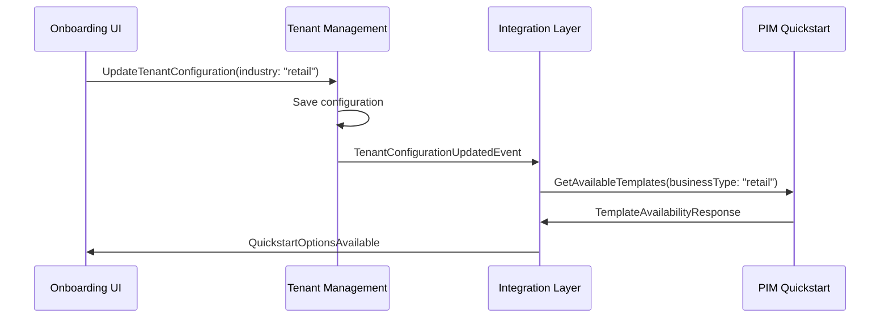
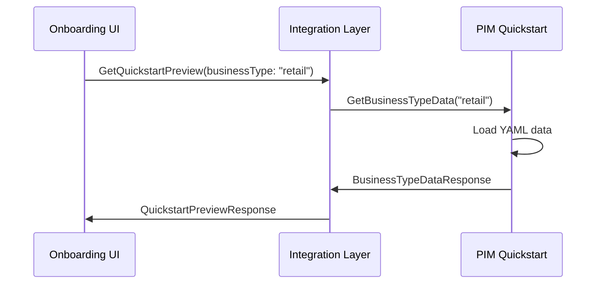
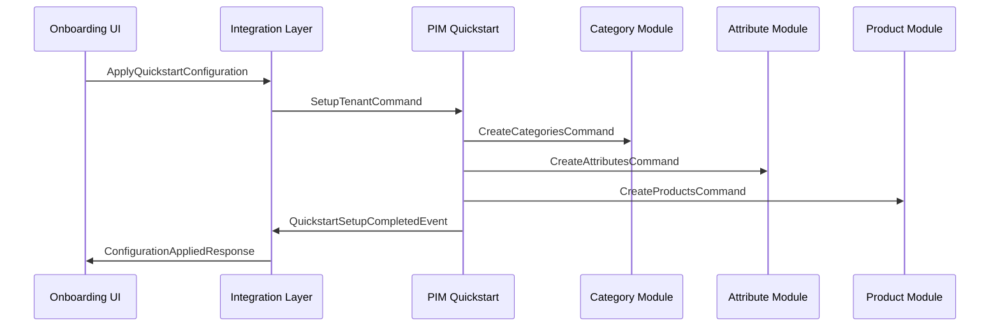

# 🔗 Integración Técnica: Onboarding ↔ PIM Quickstart

## Descripción General

Este documento detalla la integración técnica entre el sistema de onboarding multi-tenant y el módulo quickstart del PIM, explicando cómo ambos sistemas colaboran para proporcionar una experiencia de configuración inicial optimizada.

## 🏗️ Arquitectura de la Integración

### Componentes Principales

```
┌─────────────────────┐    ┌─────────────────────┐    ┌─────────────────────┐
│   Onboarding UI     │    │  Integration Layer  │    │   PIM Quickstart    │
│                     │    │                     │    │                     │
│ - Wizard Steps      │◄──►│ - Event Handlers    │◄──►│ - Business Types    │
│ - Business Type     │    │ - Command Mappers   │    │ - Template Loader   │
│ - Configuration     │    │ - State Sync        │    │ - Data Application  │
└─────────────────────┘    └─────────────────────┘    └─────────────────────┘
```

### Bounded Contexts Involucrados

1. **Tenant Management BC** (Onboarding)
2. **PIM Quickstart BC** (PIM)
3. **Integration BC** (Puente entre ambos)

## 🔄 Flujo de Integración Detallado

### Fase 1: Detección de Tipo de Negocio



### Fase 2: Presentación de Opciones Quickstart



### Fase 3: Aplicación de Configuración



## 📡 Eventos de Dominio

### Eventos del Onboarding

```go
type TenantConfigurationUpdatedEvent struct {
    TenantID     string    `json:"tenant_id"`
    Industry     string    `json:"industry"`
    BusinessType string    `json:"business_type"`
    Timestamp    time.Time `json:"timestamp"`
}

type OnboardingStepCompletedEvent struct {
    TenantID  string    `json:"tenant_id"`
    Step      int       `json:"step"`
    StepData  StepData  `json:"step_data"`
    Timestamp time.Time `json:"timestamp"`
}
```

### Eventos del PIM Quickstart

```go
type QuickstartSetupStartedEvent struct {
    TenantID           string    `json:"tenant_id"`
    BusinessType       string    `json:"business_type"`
    SelectedComponents []string  `json:"selected_components"`
    Timestamp          time.Time `json:"timestamp"`
}

type QuickstartSetupCompletedEvent struct {
    TenantID             string                 `json:"tenant_id"`
    BusinessType         string                 `json:"business_type"`
    ConfiguredComponents map[string]int         `json:"configured_components"`
    Timestamp            time.Time              `json:"timestamp"`
}

type QuickstartSetupFailedEvent struct {
    TenantID     string    `json:"tenant_id"`
    BusinessType string    `json:"business_type"`
    Error        string    `json:"error"`
    Timestamp    time.Time `json:"timestamp"`
}
```

## 🔧 Comandos de Integración

### Comandos del Onboarding

```go
type UpdateTenantConfigurationCommand struct {
    TenantID                string `json:"tenant_id"`
    Industry                string `json:"industry"`
    OperationType          string `json:"operation_type"`
    MultiLocationEnabled   bool   `json:"multi_location_enabled"`
    ProductVariantsEnabled bool   `json:"product_variants_enabled"`
}

type CompleteOnboardingStepCommand struct {
    TenantID string   `json:"tenant_id"`
    Step     int      `json:"step"`
    Data     StepData `json:"data"`
}
```

### Comandos del PIM Quickstart

```go
type ApplyQuickstartConfigurationCommand struct {
    TenantID          string `json:"tenant_id"`
    BusinessType      string `json:"business_type"`
    IncludeCategories bool   `json:"include_categories"`
    IncludeAttributes bool   `json:"include_attributes"`
    IncludeVariants   bool   `json:"include_variants"`
    IncludeProducts   bool   `json:"include_products"`
    IncludeBrands     bool   `json:"include_brands"`
}

type GetQuickstartPreviewCommand struct {
    BusinessType string `json:"business_type"`
    TenantID     string `json:"tenant_id"`
}
```

## 🎯 Mapeo de Tipos de Negocio

### Configuración de Mapeo

```go
type BusinessTypeMapping struct {
    OnboardingIndustry string `json:"onboarding_industry"`
    PIMBusinessType    string `json:"pim_business_type"`
    Enabled            bool   `json:"enabled"`
    DefaultComponents  []string `json:"default_components"`
}

var BusinessTypeMappings = []BusinessTypeMapping{
    {
        OnboardingIndustry: "retail",
        PIMBusinessType:    "retail",
        Enabled:            true,
        DefaultComponents:  []string{"categories", "attributes", "variants", "brands"},
    },
    {
        OnboardingIndustry: "food_beverage",
        PIMBusinessType:    "food-beverage",
        Enabled:            false,
        DefaultComponents:  []string{"categories", "attributes"},
    },
    // ... más mapeos
}
```

## 🔄 Servicios de Integración

### Integration Service

```go
type IntegrationService struct {
    onboardingService OnboardingService
    pimService        PIMQuickstartService
    eventBus          EventBus
    logger            Logger
}

func (s *IntegrationService) HandleTenantConfigurationUpdated(event TenantConfigurationUpdatedEvent) error {
    // 1. Mapear industria a tipo de negocio PIM
    businessType := s.mapIndustryToBusinessType(event.Industry)
    
    // 2. Verificar disponibilidad de template
    available, err := s.pimService.IsTemplateAvailable(businessType)
    if err != nil {
        return err
    }
    
    // 3. Notificar disponibilidad al onboarding
    if available {
        s.eventBus.Publish(QuickstartOptionsAvailableEvent{
            TenantID:     event.TenantID,
            BusinessType: businessType,
        })
    }
    
    return nil
}

func (s *IntegrationService) ApplyQuickstartConfiguration(cmd ApplyQuickstartConfigurationCommand) error {
    // 1. Validar tenant y permisos
    if err := s.validateTenant(cmd.TenantID); err != nil {
        return err
    }
    
    // 2. Aplicar configuración en PIM
    setupResult, err := s.pimService.SetupTenant(cmd)
    if err != nil {
        s.eventBus.Publish(QuickstartSetupFailedEvent{
            TenantID:     cmd.TenantID,
            BusinessType: cmd.BusinessType,
            Error:        err.Error(),
        })
        return err
    }
    
    // 3. Actualizar estado de onboarding
    s.onboardingService.MarkQuickstartCompleted(cmd.TenantID, setupResult)
    
    // 4. Publicar evento de éxito
    s.eventBus.Publish(QuickstartSetupCompletedEvent{
        TenantID:             cmd.TenantID,
        BusinessType:         cmd.BusinessType,
        ConfiguredComponents: setupResult.Components,
    })
    
    return nil
}
```

### PIM Quickstart Service

```go
type PIMQuickstartService struct {
    dataLoader     YAMLDataLoader
    categoryRepo   CategoryRepository
    attributeRepo  AttributeRepository
    productRepo    ProductRepository
    brandRepo      BrandRepository
    variantRepo    VariantRepository
}

func (s *PIMQuickstartService) SetupTenant(cmd ApplyQuickstartConfigurationCommand) (*SetupResult, error) {
    result := &SetupResult{
        TenantID:     cmd.TenantID,
        BusinessType: cmd.BusinessType,
        Components:   make(map[string]int),
    }
    
    // Cargar datos del tipo de negocio
    template, err := s.dataLoader.LoadBusinessTypeTemplate(cmd.BusinessType)
    if err != nil {
        return nil, err
    }
    
    // Aplicar configuraciones según selección
    if cmd.IncludeCategories {
        count, err := s.createCategories(cmd.TenantID, template.Categories)
        if err != nil {
            return nil, err
        }
        result.Components["categories"] = count
    }
    
    if cmd.IncludeAttributes {
        count, err := s.createAttributes(cmd.TenantID, template.Attributes)
        if err != nil {
            return nil, err
        }
        result.Components["attributes"] = count
    }
    
    if cmd.IncludeVariants {
        count, err := s.createVariants(cmd.TenantID, template.Variants)
        if err != nil {
            return nil, err
        }
        result.Components["variants"] = count
    }
    
    if cmd.IncludeProducts {
        count, err := s.createProducts(cmd.TenantID, template.Products)
        if err != nil {
            return nil, err
        }
        result.Components["products"] = count
    }
    
    if cmd.IncludeBrands {
        count, err := s.createBrands(cmd.TenantID, template.Brands)
        if err != nil {
            return nil, err
        }
        result.Components["brands"] = count
    }
    
    return result, nil
}
```

## 🔒 Seguridad y Validaciones

### Validaciones de Tenant

```go
func (s *IntegrationService) validateTenant(tenantID string) error {
    // 1. Verificar que el tenant existe
    tenant, err := s.tenantRepo.GetByID(tenantID)
    if err != nil {
        return ErrTenantNotFound
    }
    
    // 2. Verificar estado del tenant
    if tenant.Status != TenantStatusOnboarding && tenant.Status != TenantStatusActive {
        return ErrInvalidTenantStatus
    }
    
    // 3. Verificar que no tenga configuración quickstart previa
    hasQuickstart, err := s.pimService.HasQuickstartConfiguration(tenantID)
    if err != nil {
        return err
    }
    if hasQuickstart {
        return ErrQuickstartAlreadyApplied
    }
    
    return nil
}
```

### Límites de Recursos

```go
type ResourceLimits struct {
    MaxCategories int `json:"max_categories"`
    MaxAttributes int `json:"max_attributes"`
    MaxProducts   int `json:"max_products"`
    MaxBrands     int `json:"max_brands"`
    MaxVariants   int `json:"max_variants"`
}

func (s *PIMQuickstartService) validateResourceLimits(tenantID string, template *QuickstartTemplate) error {
    limits := s.getResourceLimitsForTenant(tenantID)
    
    if len(template.Categories) > limits.MaxCategories {
        return ErrExceedsMaxCategories
    }
    
    if len(template.Attributes) > limits.MaxAttributes {
        return ErrExceedsMaxAttributes
    }
    
    // ... más validaciones
    
    return nil
}
```

## 📊 Monitoreo y Métricas

### Métricas de Integración

```go
type IntegrationMetrics struct {
    QuickstartAttempts     prometheus.Counter
    QuickstartSuccesses    prometheus.Counter
    QuickstartFailures     prometheus.Counter
    QuickstartDuration     prometheus.Histogram
    ComponentsCreated      prometheus.CounterVec
}

func (s *IntegrationService) recordMetrics(result *SetupResult, duration time.Duration, err error) {
    s.metrics.QuickstartAttempts.Inc()
    
    if err != nil {
        s.metrics.QuickstartFailures.Inc()
    } else {
        s.metrics.QuickstartSuccesses.Inc()
        s.metrics.QuickstartDuration.Observe(duration.Seconds())
        
        for component, count := range result.Components {
            s.metrics.ComponentsCreated.WithLabelValues(component).Add(float64(count))
        }
    }
}
```

### Logging Estructurado

```go
func (s *IntegrationService) logQuickstartAttempt(tenantID, businessType string, components []string) {
    s.logger.Info("quickstart_attempt",
        zap.String("tenant_id", tenantID),
        zap.String("business_type", businessType),
        zap.Strings("components", components),
        zap.Time("timestamp", time.Now()),
    )
}

func (s *IntegrationService) logQuickstartResult(result *SetupResult, err error) {
    if err != nil {
        s.logger.Error("quickstart_failed",
            zap.String("tenant_id", result.TenantID),
            zap.String("business_type", result.BusinessType),
            zap.Error(err),
        )
    } else {
        s.logger.Info("quickstart_completed",
            zap.String("tenant_id", result.TenantID),
            zap.String("business_type", result.BusinessType),
            zap.Any("components", result.Components),
        )
    }
}
```

## 🧪 Testing de la Integración

### Tests de Integración

```go
func TestOnboardingPIMIntegration(t *testing.T) {
    // Setup
    integrationService := setupIntegrationService()
    
    t.Run("successful_quickstart_application", func(t *testing.T) {
        // Given
        tenantID := "test-tenant-123"
        event := TenantConfigurationUpdatedEvent{
            TenantID: tenantID,
            Industry: "retail",
        }
        
        // When
        err := integrationService.HandleTenantConfigurationUpdated(event)
        
        // Then
        assert.NoError(t, err)
        
        // Verify quickstart options are available
        options := getQuickstartOptions(tenantID)
        assert.True(t, options.Available)
        assert.Equal(t, "retail", options.BusinessType)
        
        // Apply quickstart configuration
        cmd := ApplyQuickstartConfigurationCommand{
            TenantID:          tenantID,
            BusinessType:      "retail",
            IncludeCategories: true,
            IncludeAttributes: true,
            IncludeVariants:   true,
            IncludeBrands:     true,
        }
        
        result, err := integrationService.ApplyQuickstartConfiguration(cmd)
        assert.NoError(t, err)
        assert.NotNil(t, result)
        
        // Verify components were created
        assert.Greater(t, result.Components["categories"], 0)
        assert.Greater(t, result.Components["attributes"], 0)
        assert.Greater(t, result.Components["variants"], 0)
        assert.Greater(t, result.Components["brands"], 0)
    })
}
```

## 🚀 Deployment y Configuración

### Variables de Entorno

```bash
# Configuración de integración
INTEGRATION_ENABLED=true
INTEGRATION_TIMEOUT=30s
INTEGRATION_RETRY_ATTEMPTS=3

# Configuración de eventos
EVENT_BUS_URL=nats://localhost:4222
EVENT_BUS_SUBJECT_PREFIX=saas.integration

# Configuración de límites
MAX_CATEGORIES_PER_TENANT=100
MAX_ATTRIBUTES_PER_TENANT=50
MAX_PRODUCTS_PER_TENANT=1000
MAX_BRANDS_PER_TENANT=200
MAX_VARIANTS_PER_TENANT=50
```

### Configuración de Servicios

```yaml
# docker-compose.yml
services:
  integration-service:
    image: saas/integration-service:latest
    environment:
      - INTEGRATION_ENABLED=true
      - ONBOARDING_SERVICE_URL=http://onboarding:8080
      - PIM_SERVICE_URL=http://pim:8081
      - EVENT_BUS_URL=nats://nats:4222
    depends_on:
      - onboarding
      - pim
      - nats
```

## 📋 Checklist de Implementación

### Fase 1: Configuración Básica
- [ ] Configurar event bus entre servicios
- [ ] Implementar mapeo de tipos de negocio
- [ ] Crear servicios de integración básicos
- [ ] Configurar logging y métricas

### Fase 2: Funcionalidad Core
- [ ] Implementar detección automática de opciones quickstart
- [ ] Desarrollar aplicación de configuraciones
- [ ] Agregar validaciones de seguridad
- [ ] Implementar manejo de errores

### Fase 3: Optimizaciones
- [ ] Agregar caché para templates
- [ ] Implementar rollback de configuraciones
- [ ] Optimizar performance de aplicación
- [ ] Agregar monitoreo avanzado

### Fase 4: Testing y Deployment
- [ ] Tests unitarios completos
- [ ] Tests de integración end-to-end
- [ ] Documentación de API
- [ ] Deployment en staging y producción

Esta integración proporciona una experiencia de onboarding fluida y optimizada, reduciendo significativamente el tiempo necesario para que los nuevos clientes comiencen a usar el sistema de manera productiva. 